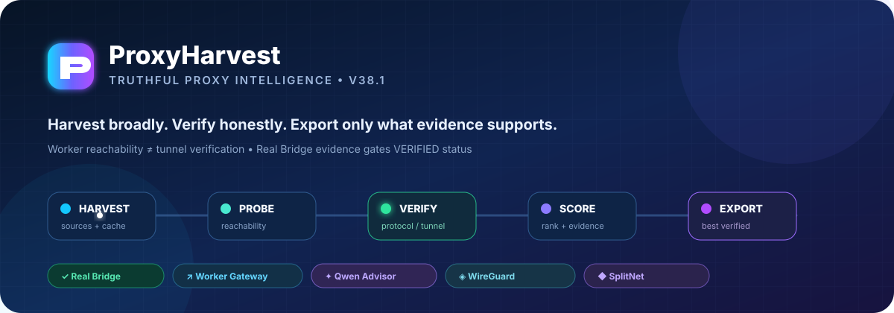
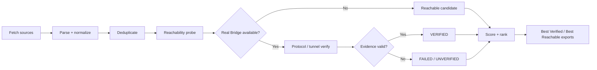
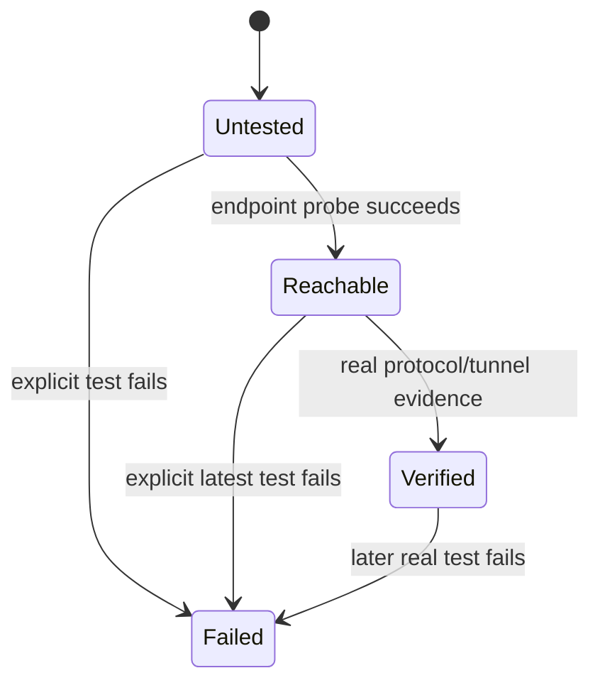
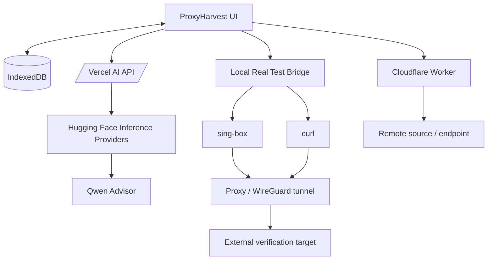
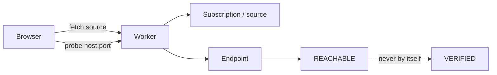
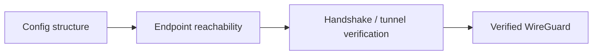
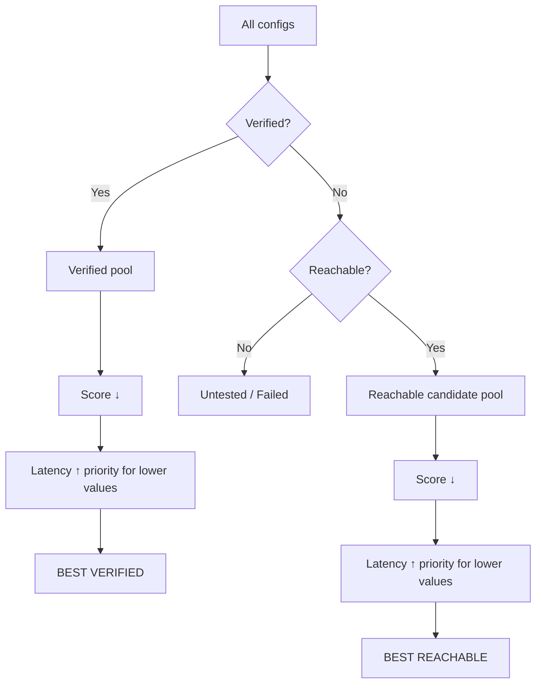

<p align="center">
  
</p>

<p align="center">
  <a href="https://github.com/nimazasinich/proxyharvest/actions/workflows/materialize-v25.1.yml"></a>
  <a href="https://github.com/nimazasinich/proxyharvest/actions/workflows/v38-runtime.yml"></a>
  
  = 22" />
  
</p>

<h1 align="center">ProxyHarvest</h1>
<p align="center"><strong>Harvest broadly. Verify honestly. Rank intelligently. Export only what the evidence supports.</strong></p>

ProxyHarvest is a browser-first proxy intelligence dashboard for harvesting, normalizing, testing, ranking, repairing, and exporting proxy configurations. It combines a Cloudflare Worker gateway, a local real-test bridge, WireGuard/SplitNet tooling, IndexedDB persistence, scoring, filtered exports, and a bounded Hugging Face / Qwen repair advisor.

> **Core rule:** `REACHABLE` is not `VERIFIED`. A Worker or browser probe can prove that an endpoint answered. Only real protocol/tunnel evidence can promote a configuration to `VERIFIED`.

---

## ✨ What ProxyHarvest does

| Capability | What it means |
|---|---|
| **Multi-source harvesting** | Collects proxy subscriptions and source feeds with cache, fallback, deduplication, and source-health visibility. |
| **Truthful verification** | Separates endpoint reachability from real protocol/tunnel verification. |
| **Autonomous pipeline** | After an explicit user Fetch action, the app can continue through verify → score → rank → summary. |
| **Real Test Bridge** | Runs local tunnel verification with `sing-box` + `curl` instead of pretending browser reachability is a working proxy. |
| **Best Verified export** | Exports only configurations backed by real verification evidence, ranked by score and latency. |
| **Best Reachable candidates** | Keeps high-quality endpoint-reachable candidates separate from verified configs. |
| **WireGuard tooling** | Parses, validates, probes, heals, and verifies WireGuard candidates when the local verifier supports them. |
| **SplitNet** | Free WARP / WireGuard candidate workspace with provenance, scoring, import/export, and verified-only export. |
| **AI Repair Lab** | Uses deterministic repair rules plus bounded Qwen advice. AI suggestions never count as verification. |
| **IndexedDB persistence** | Persists harvested configs and runtime state across page reloads. |

---

## 🧭 Runtime pipeline



The pipeline is intentionally evidence-driven. No Worker probe, browser request, AI suggestion, score, or low latency can turn a candidate into `VERIFIED` by itself.

---

## ✅ Verification state model



### Status semantics

| Status | Evidence required | Export intent |
|---|---|---|
| **VERIFIED** | `protocolVerified === true` or `tunnelVerified === true` | Eligible for **Best Verified** / Live-only export |
| **REACHABLE** | Worker / browser / bridge endpoint reachability only | Candidate only — never promoted automatically |
| **UNTESTED** | No conclusive verification evidence | Not eligible for verified export |
| **FAILED** | Explicit latest test failure | Repair, review, or remove |

---

## 🏗 Architecture



### Responsibility boundaries

| Component | Fetch sources | Endpoint reachability | Protocol/tunnel verification | Repair advice |
|---|:---:|:---:|:---:|:---:|
| **Browser UI** | ✓ | limited | ✗ | deterministic rules |
| **Cloudflare Worker** | ✓ | ✓ | ✗ | ✗ |
| **Real Test Bridge** | ✗ | ✓ | **✓** | ✗ |
| **Qwen Advisor** | ✗ | ✗ | ✗ | **✓** |

---

## 🚀 Quick start

### Requirements

- **Node.js 22+**
- For real tunnel verification: **sing-box** and **curl**
- Optional: a Hugging Face token for the Qwen repair advisor

### Install and validate

```bash
git clone https://github.com/nimazasinich/proxyharvest.git
cd proxyharvest
npm install
npm run check
npm run build
```

The canonical build writes the deployable application to `public/`.

### Start the local Real Test Bridge

```bash
npm run bridge
```

The bridge listens on:

```text
http://127.0.0.1:8787
```

The UI auto-detects the bridge. Without it, ProxyHarvest can still harvest, probe reachability, score, rank, and export candidates — but it will **not fabricate Verified Live results**.

---

## 🧪 Real verification bridge

The bridge is the trust boundary for protocol/tunnel verification.

For supported configs it:

1. builds a local `sing-box` configuration,
2. runs `sing-box check`,
3. starts a temporary local proxy/tunnel,
4. sends a real request with `curl` through that tunnel,
5. reports protocol/tunnel evidence back to ProxyHarvest,
6. cleans up the temporary process.

This is what separates a genuinely usable config from an endpoint that merely answers on a port.

### Supported real-verification direction

- VLESS / TLS / Reality-aware configs when the source config contains the required parameters
- Trojan-compatible configs
- WireGuard via sing-box WireGuard endpoint support when the config is complete
- Additional protocol handling can be extended in the bridge without weakening verification semantics

---

## 🌐 Cloudflare Worker

The Worker is used for **source fetching and endpoint reachability**, especially when direct browser access is blocked by CORS.

It is intentionally **not** a tunnel verifier.



ProxyHarvest keeps that boundary explicit throughout the dashboard, exports, and scoring model.

---

## 🧠 Repair Lab / Qwen Advisor

ProxyHarvest uses a two-layer repair model:

1. **Deterministic repair candidates** are generated locally.
2. **Qwen** may rank or recommend among those bounded candidates.

The model is not allowed to invent credentials, UUIDs, keys, hosts, or verification results. After a repair, the configuration must still pass real verification before it can become `VERIFIED`.

### Vercel environment variables

```text
HF_TOKEN=<your Hugging Face token>
HF_MODEL=Qwen/Qwen2.5-7B-Instruct-1M:fastest   # optional
```

The API uses Hugging Face Inference Providers through:

```text
https://router.huggingface.co/v1/chat/completions
```

> Never commit secrets to the repository. Use deployment environment variables.

---

## 🛡 WireGuard

WireGuard status is split into separate signals:



- A valid config structure is not proof of network reachability.
- UDP or endpoint reachability is not proof of a WireGuard handshake.
- Only the Real Test Bridge can promote a WireGuard config to verified when real tunnel evidence exists.

---

## 🔀 SplitNet

SplitNet is a dedicated workspace for free WARP / WireGuard-style candidates with:

- source provenance,
- candidate scoring,
- compact row/card views,
- copy/import/export controls,
- refresh and verification actions,
- verified-only `.txt` export,
- clear separation between candidate reachability and tunnel verification.

---

## 📊 Ranking and exports

ProxyHarvest ranks candidates using evidence first, then quality signals such as score and latency.



### Export sets

- **BEST VERIFIED** — fresh protocol/tunnel-verified configs, ranked by score then latency.
- **BEST REACHABLE** — high-score endpoint-reachable candidates, explicitly not tunnel-verified.
- **Live Only** — verified-only export path.
- **All / Filtered / Base64 / Raw URI** — workflow-specific exports from the Config Library.

The default export score floor is **70** in the V38.1 smart-default migration.

---

## ⚙️ Smart infrastructure defaults

ProxyHarvest automatically applies safe defaults where a universal default is actually valid.

| Setting | Default behavior |
|---|---|
| Worker gateway | Uses the configured ProxyHarvest Worker |
| Export score floor | `70` |
| Strict Real Ping | Enabled when a compatible local bridge is detected |
| Clean IP | Not fabricated |
| Reality public key | Not fabricated |
| Custom SNI | Not fabricated |
| Force all traffic through Worker | Off by default |

Server-specific values such as Reality keys, Clean IPs, or SNI cannot be safely guessed globally, so ProxyHarvest deliberately leaves them unset unless source evidence or the user provides them.

---

## 🖥 Main workspaces

| Page | Purpose |
|---|---|
| **Dashboard** | Pipeline progress, live status, verification counters, recent configs, runtime health |
| **Configs** | Search, filter, test, score, rank, inspect, and export configs |
| **SplitNet** | Free WARP/WireGuard candidate workflow |
| **IRCF** | WARP keys and clean Cloudflare endpoint tooling |
| **Sources** | Source catalog and source health |
| **WireGuard** | WireGuard parsing, provenance, reachability, healing, and verification |
| **Repair Lab** | Deterministic repair + bounded Qwen advice |
| **Settings** | Runtime, network, scoring, appearance, and Real Ping preferences |
| **Infrastructure** | Worker, bridge, AI API, edge settings, and health checks |

---

## 🔐 Security & correctness principles

ProxyHarvest follows a few strict rules:

- Never promote `REACHABLE` to `VERIFIED` without protocol/tunnel evidence.
- Never treat AI advice as verification.
- Never fabricate credentials or server-specific Reality/WireGuard parameters.
- Keep secrets in environment variables, not committed files.
- Prefer fail-closed status reporting when evidence is missing.
- Keep Worker reachability, browser reachability, and real tunnel verification as separate signals.

---

## 🧰 Development commands

```bash
# Syntax and contract checks
npm run check

# Build deployable output into public/
npm run build

# Start local real-test bridge
npm run bridge
```

Vercel is configured to run `npm run build` and publish the `public/` directory.

---

## 🟢 CI

The repository currently validates two major layers on `main`:

- **Validate ProxyHarvest GitHub Main** — canonical source/build contract
- **Validate ProxyHarvest V38 Runtime** — real-verifier markers, HF provider path, Worker boundary, and canonical build output

Historical failed workflow runs may remain visible in GitHub Actions, but the current V38.1 validation path passes on the validated source state.

---

## 🗺 Project philosophy

ProxyHarvest is not designed to maximize a green counter. It is designed to make the counter **mean something**.

A fast endpoint can still be a broken proxy. A reachable WireGuard server can still fail the handshake. An AI-generated repair can still be wrong. ProxyHarvest keeps those distinctions visible, measurable, and export-safe.

<p align="center">
  <strong>REACHABLE is a signal. VERIFIED is evidence.</strong>
</p>

<p align="center">
  Built around transparent verification, explicit provenance, and practical proxy operations.
</p>
